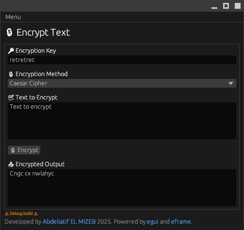
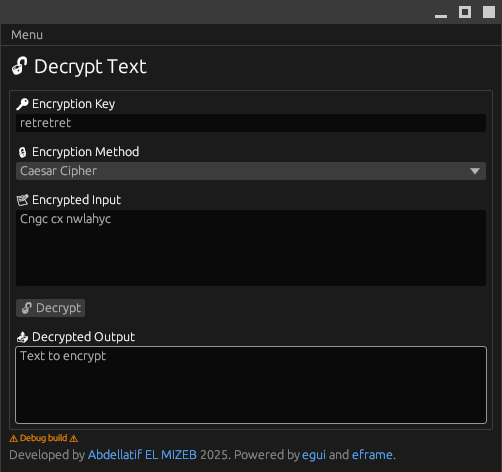
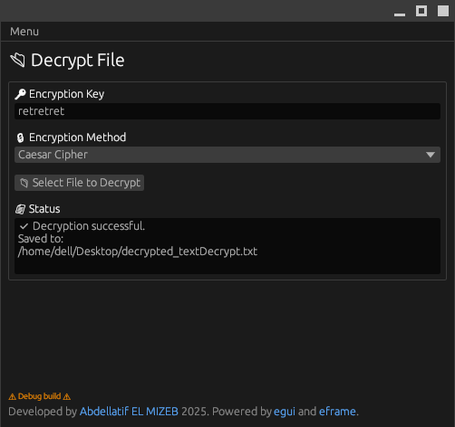

# 🔐 Rust Crypt: A Customizable Encryptor Built with Rust

<!--

-->

[](https://deps.rs/repo/github/aelmizeb/rust-crypt)

[](LICENSE)

<!--
> ⚠️ **WORK IN PROGRESS**  
> This app is currently under active development. It is not ready for use. Please do not install it.
-->

A GUI-based encryption app built with Rust to explore and test the Rust GUI ecosystem.
It allows users to encrypt and decrypt text using configurable logic. Designed to be educational, flexible, and a hands-on testbed for learning GUI development in Rust.

## 🔎 Preview
 


## 🧠 Features

- ⚙️ Customizable encryption logic (XOR, Caesar...).
- 📁 Encrypt plain text or files.
- 🧩 Supports custom keys, shifts, and encryption rules.
- 🌐 Optional Web Interface using Rust + WebAssembly (Yew).
- 💡 Built with simplicity in mind — ideal for learning how encryption works under the hood.

## 🆕 New Feature: Custom Script Encryption/Decryption
You can write your own encryption and decryption logic using Rhai, an embedded scripting language for Rust.
This allows you to define your own custom algorithms directly in the app, by entering a Rhai script for encryption and another for decryption.

Example: Simple String Reversal Script (Encrypt & Decrypt)

```bash
let result = "";
let len = text.len();
while len > 0 {
    len -= 1;
    result += text[len..len+1];
}
result
```

This script reverses the input string text by iterating backward over its characters and concatenating them.
Use the same script for encryption and decryption, as reversing twice returns the original text.

### How to Use:

1- Select Custom Script as the encryption method.

2- Enter your encryption script (e.g., the reversal script above).

3- Enter the same script for decryption.

4- Enter your key if needed (can be ignored for simple scripts).

5- Encrypt and decrypt text or files using your custom logic.

## 🚀 Getting Started

his project use [eframe](https://github.com/emilk/egui/tree/master/crates/eframe), a framework for writing apps using [egui](https://github.com/emilk/egui/).

### Clone the repository

```bash
git clone https://github.com/aelmizeb/rust-crypt.git
cd rust-crypt
```

### Testing locally

`cargo run --release`

On Linux you need to first run:

`sudo apt-get install libxcb-render0-dev libxcb-shape0-dev libxcb-xfixes0-dev libxkbcommon-dev libssl-dev`

On Fedora Rawhide you need to run:

`dnf install clang clang-devel clang-tools-extra libxkbcommon-devel pkg-config openssl-devel libxcb-devel gtk3-devel atk fontconfig-devel`

### Web Locally

You can compile your app to [WASM](https://en.wikipedia.org/wiki/WebAssembly) and publish it as a web page.

We use [Trunk](https://trunkrs.dev/) to build for web target.
1. Install the required target with `rustup target add wasm32-unknown-unknown`.
2. Install Trunk with `cargo install --locked trunk`.
3. Run `trunk serve` to build and serve on `http://127.0.0.1:8080`. Trunk will rebuild automatically if you edit the project.
4. Open `http://127.0.0.1:8080/index.html#dev` in a browser. See the warning below.

> `assets/sw.js` script will try to cache our app, and loads the cached version when it cannot connect to server allowing your app to work offline (like PWA).
> appending `#dev` to `index.html` will skip this caching, allowing us to load the latest builds during development.

### Web Deploy
1. Just run `trunk build --release`.
2. It will generate a `dist` directory as a "static html" website
3. Upload the `dist` directory to any of the numerous free hosting websites including [GitHub Pages](https://docs.github.com/en/free-pro-team@latest/github/working-with-github-pages/configuring-a-publishing-source-for-your-github-pages-site).
4. we already provide a workflow that auto-deploys our app to GitHub pages if you enable it.
> To enable Github Pages, you need to go to Repository -> Settings -> Pages -> Source -> set to `gh-pages` branch and `/` (root).
>
> If `gh-pages` is not available in `Source`, just create and push a branch called `gh-pages` and it should be available.
>
> If you renamed the `main` branch to something else (say you re-initialized the repository with `master` as the initial branch), be sure to edit the github workflows `.github/workflows/pages.yml` file to reflect the change
> ```yml
> on:
>   push:
>     branches:
>       - <branch name>
> ```
